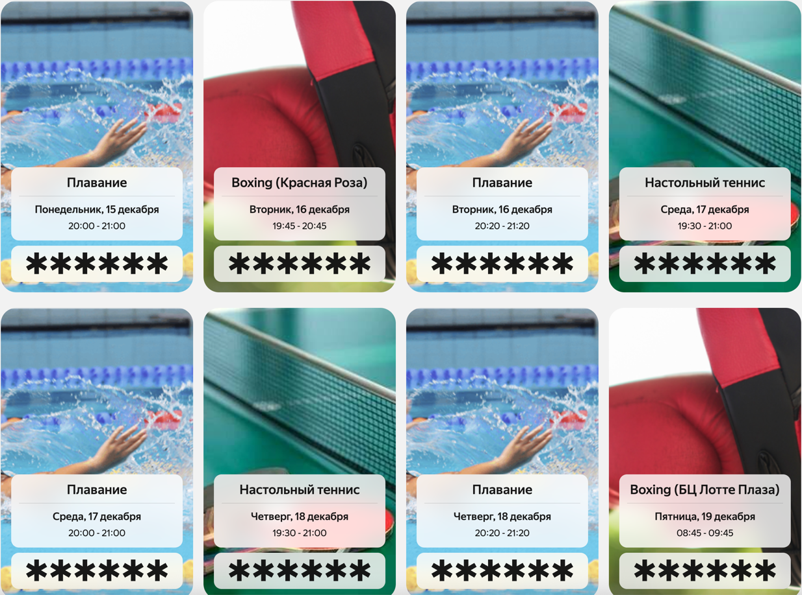

# Автоматическая регистрация на события

## Состав команды

Юркин Павел, Сергей Колесов

## Капитан команды

Юркин Павел

## Выбранная категория

Спорт

## Описание проекта

Telegram-бот для автоматического отслеживания и бронирования событий на платформе events.yandex-team.ru. Бот позволяет автоматически отслеживать доступность событий по заданным критериям и автоматически бронировать их при появлении свободных мест, избавляя пользователей от необходимости постоянно проверять доступность событий вручную.

Основная функциональность:
- Автоматический опрос событий каждую секунду
- Автоматическое бронирование событий при появлении свободных мест
- Уведомления в Telegram о успешных бронированиях
- Фильтрация событий по названию (substring matching)
- Настройка через переменные окружения

**Пример успешной работы:**



## Автоматический опрос и бронирование событий

### Пошаговая инструкция по настройке и запуску

#### Шаг 1: Настройка переменных окружения

Бот использует следующие переменные окружения для работы:

##### Обязательные переменные:

1. **`TELEGRAM_BOT_TOKEN`** (или `telegram.bot.token`)
   - Описание: Токен Telegram-бота, полученный от @BotFather

2. **`TELEGRAM_BOT_USERNAME`** (или `telegram.bot.username`)
   - Описание: Имя пользователя бота в Telegram (без символа @)
   - Пример: `TELEGRAM_BOT_USERNAME=yandex_internal_events_bot`

3. **`EVENTS_API_COOKIES`** (или `events.api.cookies`)
   - Описание: Cookie для аутентификации на events.yandex-team.ru
   - Как получить:
     1. Откройте https://events.yandex-team.ru в браузере и войдите в систему
     2. Откройте DevTools (F12) → вкладка Network
     3. Обновите страницу (F5)
     4. Кликните на любой запрос к events.yandex-team.ru
     5. Во вкладке Headers найдите "Cookie:" в Request Headers
     6. Скопируйте всё значение после "Cookie: " (правый клик → Copy value)
     7. Вставьте его как значение переменной `EVENTS_API_COOKIES` (в кавычках)
   - Пример: `EVENTS_API_COOKIES="gdpr=0; _ym_uid=...; sessionid2=...; ..."`

##### Опциональные переменные:

4. **`EVENTS_DEFAULT_CITY`** (или `events.default.city`)
   - Описание: ID города по умолчанию. Если установлено, бот не будет спрашивать пользователя о выборе города
   - Формат: Целое число
   - Примеры:
     - Москва: `EVENTS_DEFAULT_CITY=1`
     - Санкт-Петербург: `EVENTS_DEFAULT_CITY=2`
   - Примечание: Для определения актуальных ID городов запустите бота и используйте команду `/start` - бот покажет список доступных городов с их ID

5. **`EVENTS_DEFAULT_CATEGORIES`** (или `events.default.categories`)
   - Описание: ID категорий событий по умолчанию (через запятую). Если установлено, бот не будет спрашивать пользователя о выборе категорий. Если не установлено, будут показываться все категории
   - Формат: Список целых чисел через запятую
   - Пример: `EVENTS_DEFAULT_CATEGORIES="3,13"` (для категорий "Спорт" и "Здоровье")
   - Доступные категории:
     - `3` - Спорт
     - `4` - Мастер-классы
     - `7` - Развлечения
     - `8` - Добрые дела
     - `13` - Здоровье
     - `16` - Лекции
     - `17` - Образование
     - `18` - Технологии
     - `21` - Комьюнити
     - `22` - Искусство
     - `25` - Дискуссия
     - `28` - Y–ART

6. **`EVENTS_POLL_NAMES`** (или `events.poll.names`)
   - Описание: Список названий событий для отслеживания (через запятую). Бот будет автоматически бронировать события, названия которых содержат любое из указанных значений (case-insensitive, substring matching)
   - Формат: Список названий через запятую
   - Пример: `EVENTS_POLL_NAMES=бег,тренировка,йога`
   - Примечание: Сравнение происходит по подстроке, регистр не учитывается. Например, если указано `EVENTS_POLL_NAMES=бег`, то будут отслеживаться события с названиями "Бег", "Утренний бег", "Бег в парке" и т.д.

7. **`EVENTS_HOLD_LINKS`** (или `events.hold.links`)
   - Описание: Список ссылок или ID событий, которые должны быть "захолжены" (заблокированы для бронирования) при запуске приложения. Используется для тестирования
   - Формат: Список URL или ID через запятую
   - Пример: `EVENTS_HOLD_LINKS="https://events.yandex-team.ru/?city=1&eventId=event-id-1,event-id-2"`

#### Шаг 2: Запуск бота

1. Убедитесь, что все обязательные переменные окружения установлены
2. Запустите бота одним из способов:
   - **Используя скрипт `run.sh` (рекомендуется):**
     ```bash
     ./run.sh telegram
     # или просто
     ./run.sh
     ```
   - **Или через Maven напрямую:**
     ```bash
     mvn spring-boot:run
     ```
3. Найдите бота в Telegram по имени, указанному в `TELEGRAM_BOT_USERNAME`

#### Шаг 3: Первоначальная настройка в боте

**Важно:** Перед запуском бота обязательно установите все необходимые переменные окружения (см. Шаг 1). По соображениям безопасности не рекомендуется вводить cookie через Telegram - используйте переменную окружения `EVENTS_API_COOKIES`.

1. Откройте бота в Telegram и отправьте команду `/start`
2. Если не установлена переменная `EVENTS_DEFAULT_CITY`, бот покажет список доступных городов - выберите нужный (запомните ID для использования в переменной окружения)
3. Если не установлена переменная `EVENTS_DEFAULT_CATEGORIES`, бот покажет список доступных категорий - выберите нужные (запомните ID для использования в переменной окружении)

#### Шаг 4: Запуск автоматического опроса

1. Убедитесь, что установлена переменная окружения `EVENTS_POLL_NAMES` со списком названий событий для отслеживания
2. В боте отправьте команду `/start_poll`
3. Бот начнет проверять доступность событий каждую секунду
4. При появлении свободных мест событие будет автоматически забронировано
5. Вы получите уведомление в Telegram о успешной бронировке

#### Шаг 5: Остановка опроса

Для остановки автоматического опроса отправьте команду `/end_poll` в боте.

### Примеры использования

**Пример: Спортик Москва**
```bash
export TELEGRAM_BOT_TOKEN="your_token"
export TELEGRAM_BOT_USERNAME="your_bot_username"
export EVENTS_API_COOKIES="your_cookies_here"
export EVENTS_DEFAULT_CITY=1
export EVENTS_DEFAULT_CATEGORIES="3"
export EVENTS_POLL_NAMES="Boxing,волейбол,теннис,Плавание"
```

### Примечания

- Бот проверяет доступность событий каждую секунду
- Сравнение названий событий происходит по подстроке (substring matching), регистр не учитывается
- Если событие уже было забронировано ранее, бот не будет пытаться забронировать его повторно
- Если событие "захолжено" (через команду `/hold_event_link` или переменную `EVENTS_HOLD_LINKS`), бот не будет его бронировать
- Одновременно опрос может быть запущен только для одного пользователя

## Режим работы без Telegram бота (Server-Only Mode)

Приложение поддерживает режим работы без Telegram бота, который позволяет запускать сервер как автономную службу для автоматического мониторинга и бронирования событий.

### Запуск в режиме server-only

Для запуска приложения без Telegram бота используйте профиль Spring `server-only`:

```bash
java -jar telegram-bot.jar --spring.profiles.active=server-only
```

Или через переменную окружения:

```bash
export SPRING_PROFILES_ACTIVE=server-only
mvn spring-boot:run
```

### Особенности server-only режима

1. **Валидация cookie при запуске**: При старте сервер автоматически проверяет валидность cookie, пытаясь получить список событий. Если cookie невалиден или устарел, сервер завершит работу с ошибкой.

2. **Автоматический запуск опроса**: Опрос событий может быть настроен на автоматический запуск в определенное время через свойство `events.poll.start-time`.

3. **Отсутствие Telegram уведомлений**: В этом режиме уведомления в Telegram не отправляются, но все события о бронировании логируются.

### Настройка для server-only режима

#### Обязательные переменные окружения:

1. **`EVENTS_API_COOKIES`** (или `events.api.cookies`)
   - Cookie для аутентификации на events.yandex-team.ru
   - **Важно**: Cookie должен быть валидным, иначе сервер не запустится

2. **`EVENTS_POLL_NAMES`** (или `events.poll.names`)
   - Список названий событий для отслеживания (через запятую)
   - Пример: `EVENTS_POLL_NAMES=бег,тренировка,йога`

#### Опциональные переменные окружения:

3. **`EVENTS_POLL_START_TIME`** (или `events.poll.start-time`)
   - Время автоматического запуска опроса событий
   - Формат: `HH:mm` (24-часовой формат)
   - Пример: `EVENTS_POLL_START_TIME=09:00` (запуск в 9:00)
   - Если не указано вместе с `EVENTS_POLL_END_TIME`, опрос запускается сразу при старте приложения

4. **`EVENTS_POLL_END_TIME`** (или `events.poll.end-time`)
   - Время автоматической остановки опроса событий
   - Формат: `HH:mm` (24-часовой формат)
   - Пример: `EVENTS_POLL_END_TIME=18:00` (остановка в 18:00)
   - Если не указано, опрос будет работать до ручной остановки или перезапуска приложения
   - Поддерживает окна, пересекающие полночь (например, `22:00` - `06:00`)

4. **`EVENTS_DEFAULT_CITY`** (или `events.default.city`)
   - ID города по умолчанию
   - Пример: `EVENTS_DEFAULT_CITY=1` (Москва)

5. **`EVENTS_DEFAULT_CATEGORIES`** (или `events.default.categories`)
   - ID категорий событий по умолчанию (через запятую)
   - Пример: `EVENTS_DEFAULT_CATEGORIES=3,13`

### Пример запуска в server-only режиме

**Способ 1: Используя скрипт `run.sh` (рекомендуется):**
```bash
export EVENTS_API_COOKIES="your_cookies_here"
export EVENTS_POLL_NAMES="бег,тренировка"
export EVENTS_POLL_START_TIME="09:00"
export EVENTS_POLL_END_TIME="18:00"
export EVENTS_DEFAULT_CITY=1
export EVENTS_DEFAULT_CATEGORIES="3"

./run.sh server-only
```

**Способ 2: Через Maven напрямую:**
```bash
export SPRING_PROFILES_ACTIVE=server-only
export EVENTS_API_COOKIES="your_cookies_here"
export EVENTS_POLL_NAMES="бег,тренировка"
export EVENTS_POLL_START_TIME="09:00"
export EVENTS_POLL_END_TIME="18:00"
export EVENTS_DEFAULT_CITY=1
export EVENTS_DEFAULT_CATEGORIES="3"

mvn spring-boot:run
```

### Скрипт запуска (run.sh)

Проект включает удобный скрипт `run.sh` для запуска приложения:

**Использование:**
```bash
./run.sh [mode]
```

**Режимы:**
- `telegram` (по умолчанию) - запуск в режиме Telegram бота
- `server-only` - запуск в режиме без Telegram бота

**Примеры:**
```bash
# Запуск Telegram бота
./run.sh telegram
# или просто
./run.sh

# Запуск в server-only режиме
./run.sh server-only

# Показать справку
./run.sh --help
```

**Возможности скрипта:**
- Автоматическая проверка наличия Java и Maven
- Проверка версии Java (требуется Java 17+)
- Валидация обязательных переменных окружения
- Автоматическое использование предсобранного JAR файла (если доступен)
- Цветной вывод для лучшей читаемости

### Поведение при запуске

1. Сервер запускается и проверяет наличие `EVENTS_API_COOKIES`
2. Если cookie не указан, сервер завершает работу с ошибкой
3. Сервер пытается получить список событий для валидации cookie
4. Если cookie невалиден (API возвращает HTML вместо JSON), сервер завершает работу с ошибкой
5. Если валидация успешна, сервер продолжает работу
6. **Логика запуска опроса:**
   - Если `EVENTS_POLL_START_TIME` и `EVENTS_POLL_END_TIME` **не указаны**: опрос запускается **сразу** при старте приложения
   - Если указаны оба времени и текущее время находится в окне между start-time и end-time: опрос запускается **сразу**
   - Если указаны оба времени, но текущее время вне окна: опрос запустится автоматически в `EVENTS_POLL_START_TIME`
   - Опрос автоматически остановится в `EVENTS_POLL_END_TIME` (если указано)

### Примеры конфигурации времени опроса

**Пример 1: Опрос работает круглосуточно (сразу при старте)**
```bash
# Не указываем start-time и end-time
export EVENTS_POLL_START_TIME=""
export EVENTS_POLL_END_TIME=""
# Опрос запустится сразу при старте приложения
```

**Пример 2: Опрос работает только в рабочее время**
```bash
export EVENTS_POLL_START_TIME="09:00"
export EVENTS_POLL_END_TIME="18:00"
# Опрос запустится в 9:00 и остановится в 18:00
# Если приложение запущено в 10:00, опрос запустится сразу
```

**Пример 3: Опрос работает ночью (окно через полночь)**
```bash
export EVENTS_POLL_START_TIME="22:00"
export EVENTS_POLL_END_TIME="06:00"
# Опрос работает с 22:00 до 06:00 следующего дня
# Если приложение запущено в 23:00, опрос запустится сразу
```

**Пример 4: Опрос без времени окончания**
```bash
export EVENTS_POLL_START_TIME="09:00"
export EVENTS_POLL_END_TIME=""
# Опрос запустится в 9:00 и будет работать до перезапуска приложения
```

### Логирование

В server-only режиме все операции логируются в стандартный вывод:
- Успешная валидация cookie
- Запуск автоматического опроса
- Успешные бронирования событий
- Ошибки и предупреждения
